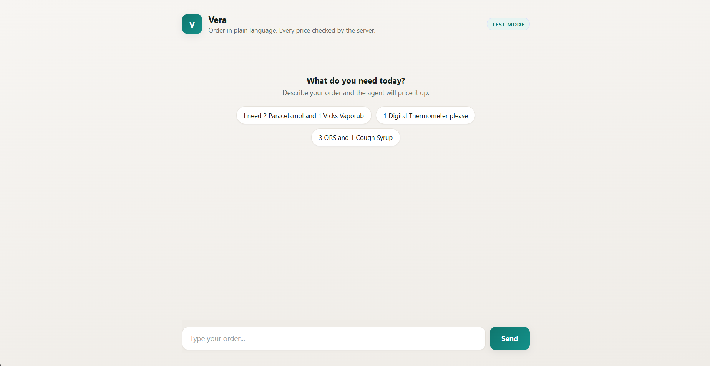
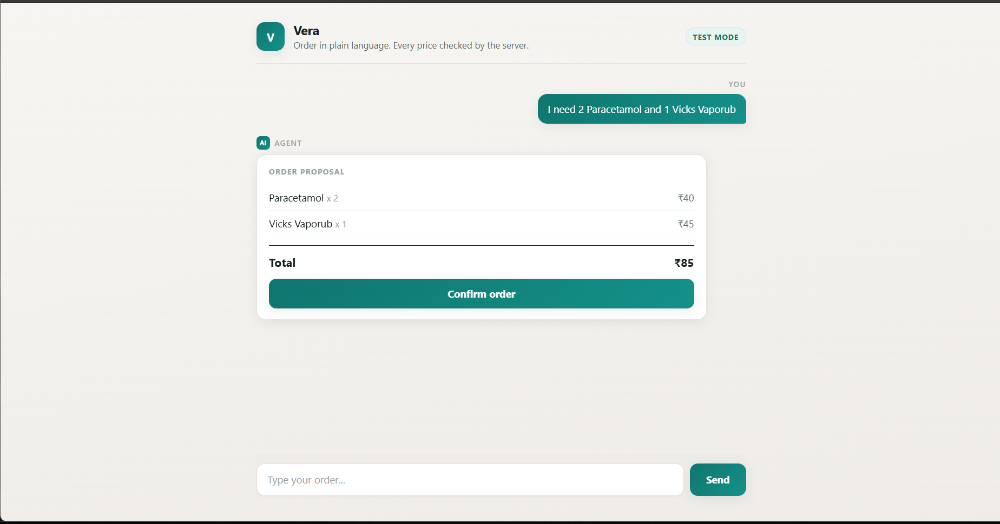
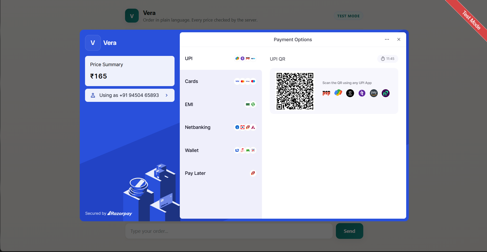
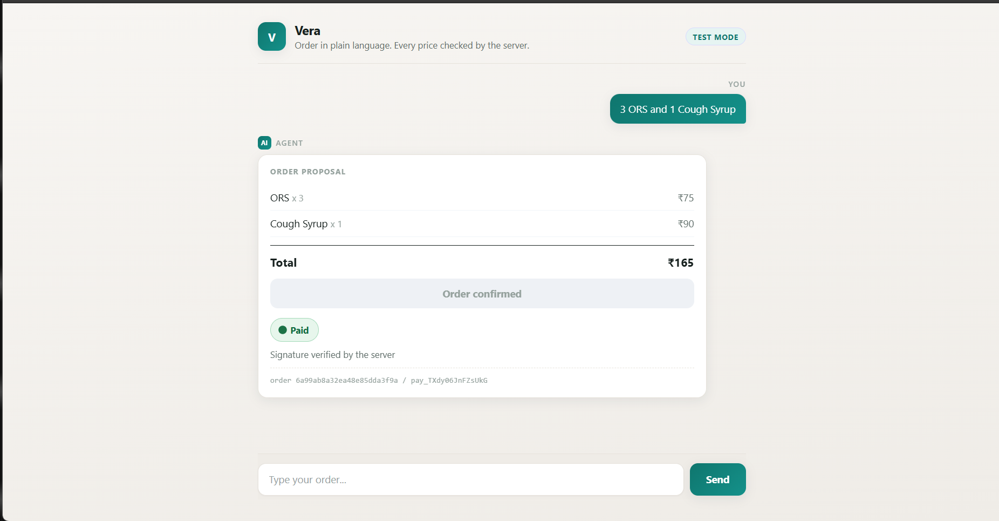
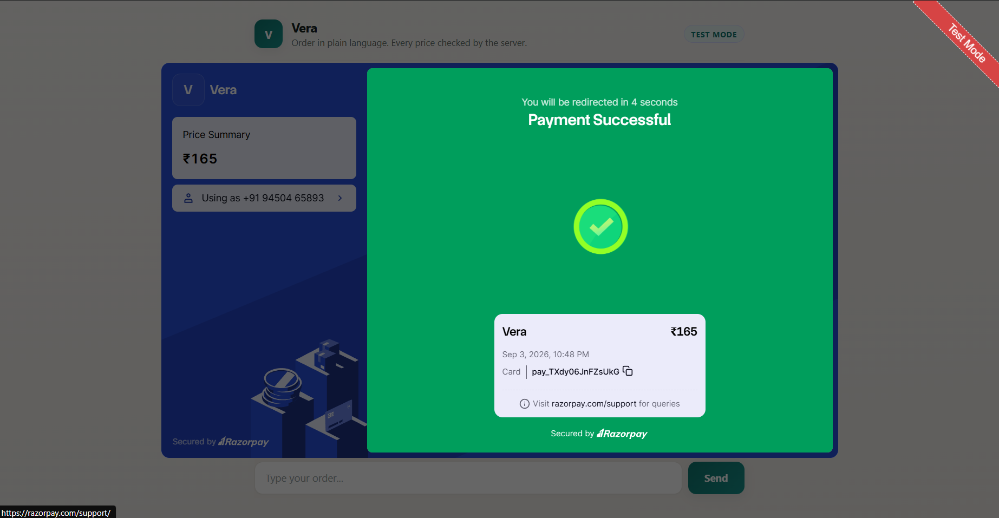
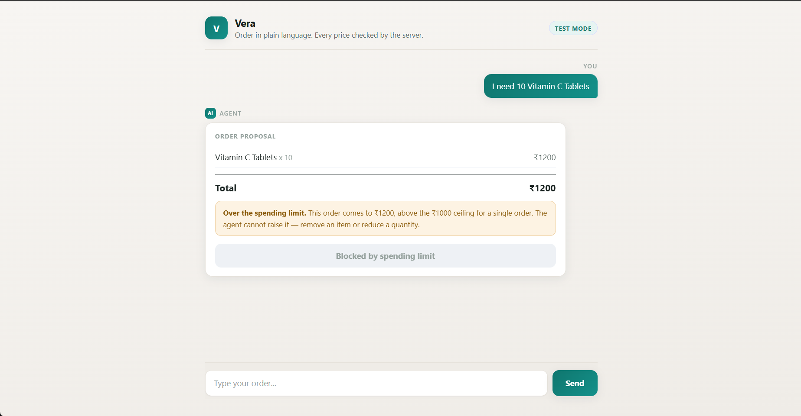
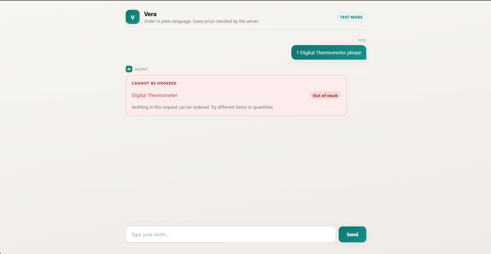
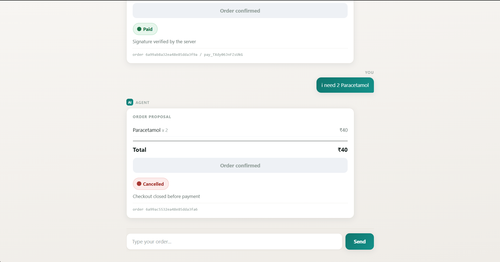
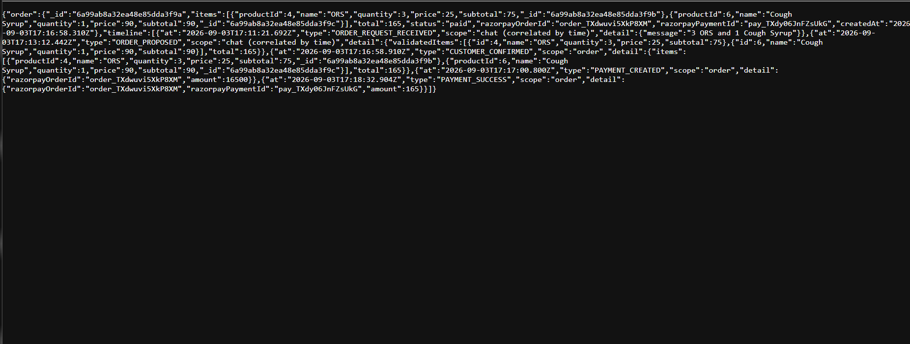

# Vera

**Vera proposes the order. The server verifies it. Nothing reaches `paid`
without a signature the server checked itself.**

A conversational ordering agent built for the Razorpay Buildathon, Track 01 —
AI Growth & Agentic Commerce. A customer describes what they need in plain
language, an LLM works out which products they mean, and the server prices,
bounds, validates and settles the order.

The demo catalog is a small over-the-counter pharmacy. Nothing in the system is
specific to medicine — the catalog is ten rows that could equally be groceries
or stationery. It carries no prescription handling and makes no clinical claims.

The interesting part is not that an AI can read an order. It is that the AI is
never trusted with anything that costs money.

---

## Walkthrough

The whole flow, in the order a customer meets it. Each step notes the guarantee
it demonstrates.

### 1. The opening screen

The agent has proposed nothing and knows nothing. Suggested phrasings let a
reviewer start without typing.



### 2. The order proposal

The customer wrote plain English. The model resolved product names and
quantities only — **every price on this card came from the server catalog**, not
from the model and not from the browser. Nothing has been charged yet.



### 3. Razorpay Checkout

Opened only after the customer confirmed. The amount shown is the one Razorpay
returned for a server-created order, so a tampered browser cannot change what is
charged.



### 4. Paid, and verified

Checkout reported success — but the order became `paid` only after the server
recomputed the HMAC signature and matched it. The order and payment IDs are
shown so this can be cross-referenced against the audit trail or the Razorpay
dashboard.



### 5. The Razorpay receipt

The same payment from Razorpay's side, in Test Mode. The amount matches the
server's total exactly.



### 6. The agent refuses to exceed its ceiling

This proposal is perfectly valid — the items exist and are in stock. It is
refused because the total is above the operator-set spending limit. **The agent
cannot raise that limit**, the confirm button is genuinely disabled, and the
refusal is recorded as `ORDER_LIMIT_EXCEEDED`.



### 7. A refusal the customer can act on

Out of stock is reported as its own kind of refusal, distinct from a bound
breach, and recorded as `STOCK_UNAVAILABLE`.



### 8. A payment the customer walked away from

Closing Checkout without paying is recorded too. The order settles as
`cancelled` rather than sitting at `payment_pending` forever, and it can never
later be moved to `paid`.



### 9. The audit trail

`GET /api/audit/:orderId` reconstructs the entire decision chain for one order,
from the customer's first message to the verified payment. Written server-side
only — nothing the customer or the model sends can forge a row.



---

## Track 01 — meeting the bar

The bar for this track is that every money action is **explainable, bounded and
gated**, with an **audit trail** and **one failure handled gracefully**. Each of
those maps to code rather than to a claim:

| The bar | Where it lives | What it does |
| --- | --- | --- |
| **Explainable** | `services/catalogService.js`, `routes/auditRoutes.js` | Every price traces to the server catalog. `GET /api/audit/:orderId` reconstructs the whole decision chain for a single order. |
| **Bounded** | `config/limits.js` | A per-item quantity cap and a per-order value ceiling, set by the operator in the environment. The agent cannot raise them. Enforced at proposal time *and* again at confirm, so bypassing the UI does not bypass the bound. |
| **Gated** | `routes/orderRoutes.js`, `routes/paymentRoutes.js` | The customer must confirm before an order exists, and only a verified HMAC-SHA256 signature can write `paid`. `/api/payments/abandon` is structurally incapable of reaching `paid`. |
| **Audit trail** | `models/AuditEvent.js`, `services/auditService.js` | Nine event types, written server-side only. Audit failures are swallowed so they can never break a customer's payment. |
| **Failure handled** | throughout | Five, not one: out of stock, over the per-item cap, over the value ceiling, payment cancelled, payment failed. Each is refused distinctly and recorded distinctly. |

Every one of those was verified by reading the database, not by trusting a
success message in the UI. The evidence is in [BUILD_NOTES.md](BUILD_NOTES.md), and the failures met
along the way — including the diagnoses that turned out to be wrong — are in
[ERRORS.md](ERRORS.md).

---

## The safety model

The agent proposes. The customer confirms. The server validates. Razorpay
executes. The audit trail records.

Every step where money could go wrong is handled by code that does not take the
LLM's word for anything:

| Concern | How it is handled |
| --- | --- |
| Product prices | Read from the server-side catalog, never from the LLM or the browser |
| Stock | Checked against the catalog at proposal time and re-checked at confirm time |
| Order size | A per-item quantity cap and a per-order value ceiling, set by the operator in the environment. The agent cannot raise them, and exceeding one is a refusal rather than a warning |
| Order total | Recomputed server-side from catalog prices on every confirm |
| Payment amount | Razorpay order is created from the stored total, never from a client-supplied figure |
| Payment success | Only a verified HMAC signature can mark an order `paid` |
| What happened | Every step is written to an append-only audit collection |

The LLM's entire job is turning `"I need 2 Paracetamol and 1 Vicks"` into
`[{name: "Paracetamol", quantity: 2}, {name: "Vicks Vaporub", quantity: 1}]`.
It is explicitly instructed not to return prices or stock, and even if it did,
nothing downstream would read them.

### Why this matters

A tampered request like this:

```json
{ "validatedItems": [{ "name": "Paracetamol", "quantity": 2, "price": 1 }], "total": 1 }
```

is saved as a ₹40 order, because the server looks the price up itself and ignores
what the client sent. Razorpay is then charged ₹40. This is tested, not assumed.

---

## Architecture

```
  Customer (React, :5173)
      |
      |  "I need 2 Paracetamol and 1 Vicks Vaporub"
      v
  POST /api/chat ─────────────► Gemini
      |                          returns {items:[{name, quantity}]} only
      |                          no prices, no stock
      v
  catalogService.validateOrder()      <-- trusted catalog
      |  prices items, checks stock
      v
  Order proposal shown to customer
      |
      |  customer clicks Confirm
      v
  POST /api/orders
      |  re-validates against the catalog
      |  recomputes the total
      |  duplicate guard
      v
  MongoDB order  { status: "payment_pending" }
      |
      v
  POST /api/payments ─────────► Razorpay: create order from the STORED total
      |                          returns razorpay order id + public key id
      v
  Razorpay Checkout opens in the browser (Test Mode)
      |
      |  payment completes
      v
  POST /api/payments/verify
      |  HMAC-SHA256(order_id|payment_id, SECRET) === signature ?
      |
      +-- valid ──────────────► status: "paid"        + PAYMENT_SUCCESS
      +-- invalid ────────────► status: "payment_failed" + PAYMENT_FAILED

  Cancelled or failed in Checkout
      |
      v
  POST /api/payments/abandon ──► "cancelled" / "payment_failed"
                                 (can never reach "paid")
```

### Order states

```
payment_pending ──► paid              (only via verified signature)
                ──► payment_failed    (bad signature, or Checkout failure)
                ──► cancelled         (customer closed Checkout)
```

Once an order leaves `payment_pending` it is settled — further attempts to change
it return HTTP 409.

---

## The audit trail

Every meaningful step writes a row to the `auditevents` collection. Rows are
written server-side only; nothing the customer or the LLM sends can forge one.

| Event | Written when |
| --- | --- |
| `ORDER_REQUEST_RECEIVED` | A customer message arrives at `/api/chat` |
| `ORDER_PROPOSED` | The catalog validated at least one item |
| `STOCK_UNAVAILABLE` | An item was rejected for stock or not being in the catalog |
| `ORDER_LIMIT_EXCEEDED` | An order was refused for breaching the value ceiling |
| `CUSTOMER_CONFIRMED` | The customer confirmed and an order was created |
| `PAYMENT_CREATED` | A Razorpay order was created |
| `PAYMENT_SUCCESS` | A signature was verified and the order became `paid` |
| `PAYMENT_FAILED` | Verification failed, or Checkout reported a failure |
| `PAYMENT_CANCELLED` | The customer closed Checkout |

Chat-stage events carry a null `orderId`, because no order exists at that point.

Recording an audit event can never break a customer's order: `recordEvent`
catches and logs its own errors rather than throwing.

---

## Tech stack

- **Frontend** — React 19 + Vite
- **Backend** — Node.js + Express 5
- **Database** — MongoDB Atlas via Mongoose
- **LLM** — Google Gemini (`@google/genai`)
- **Payments** — Razorpay Test Mode + Checkout.js

---

## Running it locally

### Requirements

- Node.js 18+
- A MongoDB Atlas cluster
- Razorpay **Test Mode** API keys
- A Google Gemini API key

### 1. Backend

```bash
cd server
npm install
cp .env.example .env
```

Fill in `server/.env` with your own values, then:

```bash
npm start
```

Expect `Server running on port 5000` and `Connected to MongoDB`.

### 2. Frontend

```bash
cd client
npm install
npm run dev
```

Open http://localhost:5173.

No frontend `.env` is needed locally — the API base falls back to
`http://localhost:5000`. When the frontend is deployed separately from the API,
set `VITE_API_URL` to the backend's public URL. Note that Vite inlines every
`VITE_` variable into the browser bundle, so no secret may go there.

### 3. Try it

Type `I need 2 Paracetamol and 1 Vicks Vaporub`, click **Confirm order**, and
pay with a Razorpay test method. Netbanking with the **Success** simulator is the
most reliable in Test Mode. If your Razorpay account has international cards
disabled, the common `4111 1111 1111 1111` test card will be rejected — use a
domestic test card such as `5267 3181 8797 5449`.

Three refusals worth seeing, each handled differently:

| Type this | What happens |
| --- | --- |
| `1 Digital Thermometer` | Out of stock — refused by the catalog |
| `15 Bandages` | Above the per-item cap — refused by the agent's own bound |
| `10 Vitamin C Tablets` | ₹1200, above the ₹1000 ceiling — proposal shown, confirm disabled |

---

## API

| Method | Route | Purpose |
| --- | --- | --- |
| `POST` | `/api/chat` | Extract and validate an order from a customer message |
| `POST` | `/api/orders` | Persist a customer-confirmed order, re-validated and re-priced |
| `POST` | `/api/payments` | Create a Razorpay order from the stored total |
| `POST` | `/api/payments/verify` | Verify the signature; the only route that can write `paid` |
| `POST` | `/api/payments/abandon` | Record a cancelled or failed payment |

---

## Known limitations

These are deliberate scope cuts for the Buildathon deadline, not oversights.

**No atomic stock decrement.** Stock is validated before an order is proposed and
again when it is confirmed, but it is never decremented on payment. Two customers
could both be sold the last unit. A production version would decrement stock
inside a transaction on verified payment, and release it if verification failed.

**The duplicate-order guard is check-then-act.** `/api/orders` looks for an
identical pending order from the last two minutes and reuses it, and the Confirm
button locks on click. This covers the double-click that produced the bug in
practice. Two genuinely simultaneous requests can still both insert — closing
that needs a unique partial index on a cart fingerprint.

**No conversation memory.** `/api/chat` is stateless and the client sends only
the current message. The agent can ask for clarification, and a customer can
answer with a self-contained reply like `make it 2 Paracetamol`, but a
referential one like `yes 3 of those` will not resolve — there is no prior turn
to resolve it against.

**No rate limiting or deep input sanitization.** There is nothing to stop a
client hammering `/api/chat`, which costs real Gemini quota. The free tier is
capped at 20 requests per day per project, which is easy to exhaust while
testing.

**Payment confirmation depends on the browser.** Verification runs when Checkout
returns to the page. If the customer closes the tab at the wrong moment, a
genuinely successful payment can be left at `payment_pending`. Razorpay webhooks
are the production answer, since they arrive server-to-server.

**Audit timelines correlate chat events by time.** Events recorded before an
order exists carry a null `orderId`, so `GET /api/audit/:orderId` associates them
by a 10-minute lookback window. With concurrent traffic, unrelated chat events
can appear in a timeline; they are labelled as time-correlated rather than
presented as linked.

**No authentication.** There are no user accounts, so orders are not owned by
anyone. `/api/payments/abandon` is safe regardless: it can only move an order out
of `payment_pending`, never into `paid`.

**Catalog is a static file.** `server/data/catalog.js` is a hardcoded array rather
than a database collection.

---

## Repository layout

```
client/
  src/App.jsx              chat UI, order proposal, Checkout integration
server/
  index.js                 Express app, CORS, MongoDB connection
  data/catalog.js          the trusted product catalog
  models/Order.js          order schema and status enum
  models/AuditEvent.js     audit trail schema
  routes/chatRoutes.js     LLM extraction + catalog validation
  routes/orderRoutes.js    confirm, re-validate, re-price, duplicate guard
  routes/paymentRoutes.js  Razorpay order, signature verification, abandonment
  services/llmService.js   Gemini prompt and call
  services/catalogService.js  product lookup, stock and quantity validation
  services/auditService.js    audit event writer
  scripts/dev-only/        scratch scripts, not part of the application
```
